# BLKOUT Archive Transfer & Communication Strategy - Implementation Plan

## 🎯 Strategic Overview

This comprehensive implementation plan transforms BLKOUT's communication ecosystem by centralizing all channels through the website portal while building strategic partnerships and preserving valuable content archives.

**Core Objectives:**
- ✅ Establish website as primary communication hub
- ✅ Build influential partnership maven network  
- ✅ Preserve and enhance content archives
- ✅ Activate automated social media amplification
- ✅ Create regular newsletter touchpoints
- ✅ Integrate community engagement through BLKOUTHUB

## 🚀 Phase 1: Infrastructure Activation (IMMEDIATE - Week 1-2)

### ⚡ Day 1-3: System Activation

**CRITICAL DISCOVERY**: Your social media automation infrastructure is **ALREADY COMPLETE**. The systems just need API credentials to go live.

**Existing Systems Ready for Activation:**
```bash
✅ api/webhooks/social-media-automation.js - Multi-platform automation
✅ api/webhooks/blkouthub-integration.js - Community integration  
✅ api/webhooks/newsletter-digest.js - Maven network newsletters
✅ Partnership proposal system - Professional partnership portal
✅ Photo competition with action research capabilities
```

**Immediate Actions:**
1. **Test Existing Infrastructure:**
   ```bash
   curl -X POST https://yoursite.com/api/webhooks/social-media-automation -d '{"test": true}'
   curl -X POST https://yoursite.com/api/webhooks/blkouthub-integration -d '{"test": true}' 
   curl -X POST https://yoursite.com/api/webhooks/newsletter-digest -d '{"test": true}'
   ```

2. **Choose Integration Method:**
   - **Composio (RECOMMENDED)**: $30-50/month, full control, 2-3 hours setup
   - **Zapier (FASTEST)**: $50-200/month, visual workflows, 30-60 minutes setup
   - **n8n (FLEXIBLE)**: $15-30/month, open source, 4-6 hours setup

3. **Platform API Configuration:**
   - LinkedIn: Developer account + API keys
   - Instagram: Business account + Graph API
   - Facebook: Page access tokens
   - YouTube: Channel API credentials
   - Twitter: Developer portal access

### 🔗 Week 1-2: Social Media Automation Full Activation

**Platform Readiness Status:**
| Platform | Infrastructure | Templates | Integration | Status |
|----------|---------------|-----------|-------------|---------|
| LinkedIn | ✅ Complete | ✅ Professional | ✅ Built | 🟡 Needs API Keys |
| Instagram | ✅ Complete | ✅ Visual-focused | ✅ Built | 🟡 Needs API Keys |
| Facebook | ✅ Complete | ✅ Community | ✅ Built | 🟡 Needs API Keys |
| YouTube | ✅ Complete | ✅ Video-ready | ✅ Built | 🟡 Needs API Keys |
| Twitter | ✅ Complete | ✅ Optimized | ✅ Built | 🟡 Needs API Keys |

**Expected Result**: Automated cross-platform posting within 48 hours of API setup.

## 📊 Phase 2: Content Archive Migration (Week 2-4)

### Content Assessment Framework

**Priority Classification:**
1. **Tier 1 (URGENT):** SEO-valuable pages, evergreen educational content, popular posts
2. **Tier 2 (IMPORTANT):** Historical articles, community discussions, resource libraries
3. **Tier 3 (ARCHIVE):** Outdated announcements, duplicate content, low-engagement posts

### Technical Migration Strategy

**SEO Preservation Protocol:**
```bash
# Content migration checklist:
✅ Maintain existing URL patterns
✅ Create comprehensive 301 redirect mapping  
✅ Preserve meta descriptions and title tags
✅ Update schema markup for enhanced search visibility
✅ Add internal linking to boost SEO
✅ Optimize images and media files
```

**Migration Workflow:**
1. **Content Audit (Week 2):** Systematic inventory across all platforms
2. **SEO Analysis (Week 2):** Identify high-value pages for priority migration
3. **Technical Setup (Week 3):** Redirect mapping and URL structure preservation
4. **Content Transfer (Week 3-4):** Systematic migration with optimization
5. **Testing & Validation (Week 4):** Link checking and search visibility verification

## 🤝 Phase 3: Partnership Maven Network Development (Week 3-6)

### Maven Identification Strategy

**Target Categories:**
1. **Industry Thought Leaders:** D&I executives, social justice advocates, community organizers
2. **Media Personalities:** Journalists, podcast hosts, YouTube creators, newsletter publishers  
3. **Organizational Partners:** Nonprofits, community centers, educational institutions, progressive businesses
4. **Cultural Influencers:** Artists, writers, activists, community builders

### Automated Partnership System

**Partnership Proposal Automation:**
```javascript
const partnershipTypes = {
  contentCollaboration: {
    template: 'content-collab-template',
    followUp: [7, 14, 30], // days
    success_metrics: ['response_rate', 'collaboration_completion']
  },
  eventCohosting: {
    template: 'event-partnership-template',
    followUp: [3, 10, 21], 
    success_metrics: ['event_attendance', 'cross_promotion_reach']
  },
  resourceSharing: {
    template: 'resource-share-template',
    followUp: [14, 30],
    success_metrics: ['resource_usage', 'reciprocal_sharing']
  }
};
```

**Relationship Management Workflow:**
- Initial outreach response rates tracking
- Collaboration completion rates monitoring
- Cross-promotional effectiveness measurement
- Long-term relationship value assessment

## 🌐 Phase 4: Communication Portal Transition (Week 4-8)

### User Migration Campaign Strategy

**Multi-Channel Transition Approach:**

1. **Social Media Announcements:**
   - "Major updates coming to our central hub"
   - Behind-the-scenes content creation previews
   - Exclusive website-only content teasers

2. **Email Migration Sequence:**
   - **Week 1:** Announcement of enhanced website experience
   - **Week 2:** Exclusive content preview for early adopters  
   - **Week 3:** Migration incentives and community benefits
   - **Week 4:** Final migration push with community FOMO

3. **Cross-Platform Redirect Strategy:**
   - Implement soft redirects initially (preserving platform presence)
   - Gradual transition to hard redirects
   - Maintain strategic presence while driving primary traffic to website

### Traffic Consolidation Metrics

**Key Performance Indicators:**
- Website session increase: **40% target within 6 weeks**
- Social media click-through rates to website: **15% minimum**
- Email open rates and website referrals: **35% open rate target**
- Partnership-driven traffic growth: **25% increase via maven network**

## 📰 Newsletter Integration Strategy  

### Content Aggregation Framework

**Weekly Digest Structure:**
- **Community Highlights:** Top BLKOUTHUB discussions and member achievements
- **Action Research Updates:** Latest findings from photo competition and community impact studies
- **Partnership Spotlights:** Maven collaborations and joint initiatives
- **Upcoming Events:** Community gatherings, competitions, and important dates  
- **Resource Sharing:** Tools, articles, educational materials, and actionable resources

**Segmentation Strategy:**
- **General Community (60%):** Broad updates and community highlights
- **Maven Network (25%):** Partnership opportunities and collaborative projects
- **Activists (10%):** Action research findings and advocacy resources  
- **Event Participants (5%):** Activity-specific updates and follow-ups

### Automated Newsletter Workflow

**Content Sources Integration:**
```javascript
const newsletterContent = {
  weeklyTrigger: 'Sunday 6PM GMT',
  contentSources: [
    'website-posts', // Latest articles and announcements
    'blkouthub-highlights', // Community platform top content
    'social-media-top-performers', // Viral posts and engagement winners
    'partnership-updates', // Maven network collaborations
    'event-summaries', // Recent event highlights and upcoming previews
    'photo-competition-updates' // Competition submissions and winner highlights
  ],
  autoGeneration: true,
  personalizedSegments: true,
  performanceTracking: 'comprehensive'
};
```

## 🔗 BLKOUTHUB Connection Optimization

### Seamless Integration Features

**Community Event Integration:**
- ✅ Automated event posting from BLKOUTHUB to social channels
- ✅ Registration data synchronization across platforms
- ✅ Post-event content aggregation and sharing
- ✅ Photo competition integration with automated social sharing

**Newsroom Connection:**
- ✅ Real-time news update distribution across all channels
- ✅ Community reaction aggregation and sentiment analysis
- ✅ Discussion thread promotion across social platforms
- ✅ Expert commentary coordination through maven network

**Content Flow Automation:**

```mermaid
graph TD
    A[BLKOUT Website] --> B[Social Media Automation]
    A --> C[Newsletter System] 
    A --> D[BLKOUTHUB Integration]
    A --> E[Partnership Management]
    
    B --> F[LinkedIn Professional Updates]
    B --> G[Instagram Visual Stories]
    B --> H[Facebook Community Posts] 
    B --> I[YouTube Community Tab]
    B --> J[Twitter Real-time Updates]
    
    C --> K[Weekly Community Digest]
    C --> L[Maven Partnership Updates]
    C --> M[Action Research Alerts]
    
    D --> N[Community Events Promotion]
    D --> O[Discussion Thread Amplification] 
    D --> P[Photo Competition Integration]
    
    E --> Q[Partnership Proposal Automation]
    E --> R[Relationship Management CRM]
    E --> S[Collaboration Tracking]
```


## 📈 Success Metrics & KPI Framework

### Quantitative Measures (8-Week Targets)

**Traffic & Engagement:**
- Website traffic increase: **40% minimum** 
- Social media engagement rate: **25% improvement across all platforms**
- Newsletter open rates: **35%+ consistent performance**
- Partnership response rate: **15%+ for initial outreach campaigns**

**Community Growth:**
- BLKOUTHUB active users: **30% increase in weekly active users**
- Email subscriber growth: **50+ new subscribers per week consistently** 
- Social media follower growth: **20% across all platforms combined**
- Maven network size: **25+ active partnerships within 6 months**

**Automation Efficiency:**
- Content posting time savings: **80% reduction** (from 8 hours/week to 1.5 hours/week)
- Cross-platform reach: **300%+ improvement** through automated amplification
- Partnership outreach efficiency: **60% time savings** through automation

### Qualitative Measures

**Community Sentiment:**
- Brand authority and thought leadership positioning
- Community feedback sentiment analysis (target: 85%+ positive)
- Partnership collaboration quality assessment  
- Content engagement depth analysis (comments, shares, saves ratio)

## ⚠️ Risk Assessment & Mitigation

### Potential Challenges & Strategic Solutions

1. **User Resistance to Migration:**
   - **Risk Level:** Medium
   - **Solution:** Gradual transition with exclusive content incentives and clear value proposition

2. **Content Quality During Migration:**
   - **Risk Level:** Medium  
   - **Solution:** Systematic review process with quality checkpoints and SEO optimization

3. **Partnership Outreach Fatigue:**
   - **Risk Level:** Low
   - **Solution:** Personalized, value-first approach with clear mutual benefits and spaced communication

4. **Technical Integration Issues:**
   - **Risk Level:** Low (infrastructure already built)
   - **Solution:** Comprehensive testing environment and rollback procedures ready

5. **Social Media Algorithm Changes:**
   - **Risk Level:** Medium
   - **Solution:** Diversified platform strategy with emphasis on owned media (website, newsletter)

## 💰 Resource Requirements

### Technical Resources
- **Web development** for migration and optimization: 20-30 hours/week for 4 weeks
- **Content creation and optimization**: 15-20 hours/week ongoing  
- **Social media automation setup and management**: 10 hours/week initially, 3 hours/week ongoing

### Human Resources
- **Project coordinator** for implementation oversight: 0.5 FTE for 8 weeks
- **Content strategist** for migration and newsletter creation: 0.75 FTE for 6 weeks
- **Community manager** for engagement and BLKOUTHUB integration: 0.5 FTE ongoing
- **Partnership outreach specialist**: 0.25 FTE for 12 weeks, then 0.1 FTE ongoing

### Financial Investment
- **Platform subscriptions** (Composio/Zapier, social media management tools): $100-300/month
- **Content creation tools and premium resources**: $150-250/month
- **Promotional budget** for migration campaigns and partnership events: $500-1000/month

## 🎯 Immediate Action Plan - Next 48 Hours

### Priority 1: Social Media Automation Activation

**Today (Day 1):**
1. ✅ Test existing automation infrastructure endpoints
2. ✅ Choose integration method (Composio recommended for cost-effectiveness)
3. ✅ Begin API credential setup for LinkedIn and Twitter (highest ROI platforms)

**Tomorrow (Day 2):**
1. ✅ Complete LinkedIn and Twitter automation setup
2. ✅ Test automated posting with sample content
3. ✅ Configure Instagram and Facebook APIs
4. ✅ Set up basic newsletter digest automation

### Priority 2: Content Migration Initiation

**Day 3-7:**
1. ✅ Complete content audit of existing platforms
2. ✅ Identify top 20 high-value pieces for immediate migration  
3. ✅ Set up redirect mapping structure
4. ✅ Begin systematic content transfer with SEO optimization

### Priority 3: Maven Network Launch

**Week 2:**
1. ✅ Compile initial list of 50 potential maven partners
2. ✅ Research contact information and engagement preferences
3. ✅ Prepare personalized outreach templates using partnership proposal system
4. ✅ Launch pilot outreach to 10 high-priority prospects

## 🏆 Expected Outcomes Timeline

### Week 2: **Foundation Activated**
- Social media automation operational across all platforms
- Basic newsletter digest system running
- Content migration plan finalized and initiated

### Month 1: **System Integration Complete** 
- 40%+ increase in website traffic
- 25%+ improvement in social media engagement
- First 5-10 maven partnerships established
- Newsletter subscriber base growing 50+/week

### Quarter 1: **Full Ecosystem Operational**
- Website established as primary communication hub
- 25+ active maven partnerships driving amplification
- Automated systems saving 80% of manual posting time
- Community growth accelerated through integrated approach

### Quarter 2: **Strategic Expansion**
- Partnership network driving measurable resource access and opportunities
- Archive transfer complete with improved SEO performance
- Newsletter and automation systems optimized based on performance data
- Foundation set for 2026 Photography Award and Pride Tour initiatives

---

## 📞 Implementation Support

**Ready to begin implementation immediately.** 

Your infrastructure is built and ready—we just need to activate it. The social media automation revolution can begin within 48 hours of API credential setup.

**Next step: Choose your integration method and let's activate your communication ecosystem transformation.**