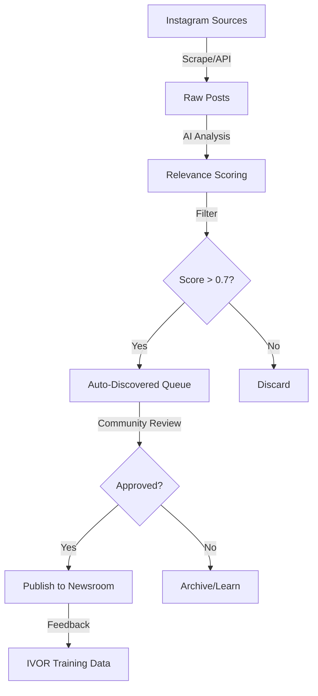

# PRD-005: Instagram Content Discovery & Moderation Automation

## Status
🔴 Not Started

## Priority
**P2 - Medium** - Enhances content pipeline

## Overview
Automate discovery of relevant Black LGBTQ+ content from trusted Instagram sources, with community moderation workflow for approval before publishing to newsroom.

## Problem Statement
From migrations and service files:
- Instagram sources tracked in `instagram_sources` table
- Trusted organizations identified (Black Pride London, etc.)
- Liberation-focused hashtags monitored (#BlackPrideLondon, #BlackLGBTUK, #QTBIPOCEvents)
- **No automated content discovery running**
- **Manual curation time-consuming**

## Goals
1. **Automated content discovery** from 20+ trusted Instagram accounts
2. **AI-powered relevance scoring** (liberation-focused, community-aligned)
3. **Community moderation queue** for approval workflow
4. **Chrome extension integration** for manual curation
5. **IVOR training data** from approved content

## Success Metrics
- 50+ relevant posts discovered per week
- 70%+ approval rate (well-targeted discovery)
- <2 hours/week for moderation (vs 8+ hours manual)
- Community moderators approve 30+ posts/week
- IVOR training corpus grows by 100+ items/month

## Technical Requirements

### Database Schema (Already Exists!)
```sql
-- From /migrations/002_instagram_sources_schema.sql

instagram_sources (
  handle TEXT,
  organization_name TEXT,
  verified_community_org BOOLEAN,
  trust_level TEXT, -- 'high' | 'medium' | 'low'
  last_scraped TIMESTAMPTZ
)

auto_discovered_content (
  title TEXT,
  url TEXT,
  source TEXT,
  content_type TEXT,
  relevance_score DECIMAL,
  liberation_focus TEXT[],
  status TEXT, -- 'auto_discovered' | 'community_approved' | 'rejected'
  needs_community_approval BOOLEAN
)

liberation_hashtags_performance (
  hashtag TEXT,
  community_verified BOOLEAN,
  black_lgbt_relevance DECIMAL,
  grassroots_organization_rate DECIMAL
)
```

### Instagram API Integration

**Approach 1: Official Instagram Graph API**
- Requires Business Account
- Rate limits: 200 calls/hour
- Access to public posts only

**Approach 2: Third-Party Scraping (Apify/Bright Data)**
- More flexible
- Can access more content
- Costs ~$50-200/month

**Approach 3: Chrome Extension Manual Capture**
- Already built! (`blkout-extension/`)
- Community members curate manually
- No API costs

**Recommendation:** Hybrid approach - Chrome extension NOW, add API later

### Content Discovery Workflow



### Relevance Scoring Algorithm
```typescript
interface ScoringFactors {
  blackLGBTKeywords: number    // 0-1 score
  grassrootsOrganizing: number // 0-1 score
  communityVoices: boolean     // +0.2 if present
  liberationFocus: number      // 0-1 score
  trustScore: number           // Based on source
  engagementRate: number       // Likes/followers ratio
}

function calculateRelevanceScore(post: InstagramPost): number {
  const factors: ScoringFactors = {
    blackLGBTKeywords: analyzeKeywords(post.caption, BLACK_LGBT_KEYWORDS),
    grassrootsOrganizing: analyzeKeywords(post.caption, ORGANIZING_KEYWORDS),
    communityVoices: post.caption.includes('"') || post.caption.includes('says'),
    liberationFocus: analyzeLiberationThemes(post.caption),
    trustScore: getTrustScore(post.username),
    engagementRate: post.likes / post.followers
  }

  // Weighted score
  return (
    factors.blackLGBTKeywords * 0.3 +
    factors.grassrootsOrganizing * 0.25 +
    (factors.communityVoices ? 0.2 : 0) +
    factors.liberationFocus * 0.15 +
    factors.trustScore * 0.1
  )
}
```

### Trusted Instagram Sources (Already Defined!)
From `/src/services/instagramContentDiscovery.ts`:
```typescript
{
  handle: '@blackpridelondon',
  organization_name: 'Black Pride London',
  verified_community_org: true,
  trust_level: 'high'
}
// + 20 more organizations
```

## Implementation Steps

### Phase 1: Chrome Extension Activation (Week 1)
- [ ] Test existing Chrome extension
- [ ] Deploy to beta community moderators
- [ ] Create moderation queue dashboard
- [ ] Add "Quick Approve" workflow
- [ ] Monitor first 50 submissions

### Phase 2: Auto-Discovery Setup (Week 2)
- [ ] Choose scraping approach (API vs third-party)
- [ ] Build Instagram content fetcher
- [ ] Implement relevance scoring algorithm
- [ ] Test with known good/bad examples
- [ ] Tune scoring thresholds

### Phase 3: Moderation Workflow (Week 2-3)
- [ ] Build moderation queue UI
- [ ] Add bulk approve/reject
- [ ] Implement moderation roles/permissions
- [ ] Create IVOR training data export
- [ ] Add feedback loop for scoring

### Phase 4: Automation & Scheduling (Week 3)
- [ ] Create cron job (daily scraping)
- [ ] Implement rate limiting
- [ ] Add error alerting
- [ ] Monitor content quality
- [ ] Generate weekly reports

## UI Components

### Moderation Queue Dashboard
```typescript
<ModerationQueue>
  <FilterBar>
    <SourceFilter /> {/* Filter by Instagram account */}
    <ScoreFilter /> {/* Show only high-confidence */}
    <DateFilter />
  </FilterBar>

  <ContentGrid>
    {autoDiscoveredPosts.map(post => (
      <ModerationCard
        post={post}
        score={post.relevance_score}
        actions={
          <>
            <ApproveButton />
            <RejectButton />
            <NeedsReviewButton />
          </>
        }
      />
    ))}
  </ContentGrid>
</ModerationQueue>
```

### Chrome Extension Integration
```typescript
// Already exists: /blkout-extension/
// Improvements needed:
- Add Instagram-specific capture
- One-click "Submit to Moderation Queue"
- Show current queue status
- Moderator leaderboard (gamification)
```

## Files Involved
```
✅ /migrations/002_instagram_sources_schema.sql - Schema exists!
✅ /src/services/instagramContentDiscovery.ts - Source list exists!
✅ /blkout-extension/ - Chrome extension exists!
📝 /src/services/instagramScraper.ts - Scraping logic (needs creation)
📝 /src/components/admin/ModerationQueue.tsx - UI (needs enhancement)
📝 /src/lib/relevance-scoring.ts - Scoring algorithm (needs creation)
```

## Environment Variables
```bash
# Instagram API (if using official API)
INSTAGRAM_ACCESS_TOKEN=your-access-token
INSTAGRAM_APP_ID=your-app-id
INSTAGRAM_APP_SECRET=your-app-secret

# OR Third-party scraping
APIFY_API_TOKEN=your-apify-token
# OR
BRIGHTDATA_API_KEY=your-brightdata-key

# Content moderation
MIN_RELEVANCE_SCORE=0.7
AUTO_APPROVE_THRESHOLD=0.9  # Very high confidence
```

## Dependencies
- Supabase database (schema already exists!)
- Chrome extension (already built!)
- Instagram API access OR scraping service
- Community moderators (recruit 3-5 people)

## Risks & Mitigation

**Risk 1: Instagram API Rate Limits**
- Mitigation: Use third-party service, implement queueing, batch requests

**Risk 2: Low-Quality Content Discovered**
- Mitigation: Tune scoring algorithm, community moderation required

**Risk 3: Source Account Blocks/Privacy Changes**
- Mitigation: Diversify sources, monitor for errors, fallback to extension

**Risk 4: Moderator Burnout**
- Mitigation: Gamification, rotation, reduce queue size with better scoring

## Cost Estimates

**Instagram Scraping:**
- Official API: Free (rate-limited)
- Apify: ~$50-100/month (10K posts)
- Bright Data: ~$100-200/month

**Storage:**
- Images/videos cached: ~$5-10/month (S3/Supabase storage)

**Total:** ~$50-200/month depending on approach

**Recommendation:** Start with Chrome extension (free), add API when scaling

## Acceptance Criteria
- [ ] 20+ Instagram sources actively monitored
- [ ] 50+ posts discovered per week
- [ ] Relevance score >0.7 for 70%+ of discoveries
- [ ] Moderation queue accessible to community moderators
- [ ] Approved content auto-publishes to newsroom
- [ ] IVOR training data exported weekly
- [ ] Chrome extension integrated with queue

## Next PRD Dependencies
- PRD-006: IVOR Training Pipeline (uses approved content)
- PRD-003: Newsletter Automation (includes discovered content)

---

**Owner:** Content Curation & Moderation Team
**Created:** 2025-11-14
**Est. Completion:** 3 weeks from start
**Depends On:** None (schema exists, extension exists)
