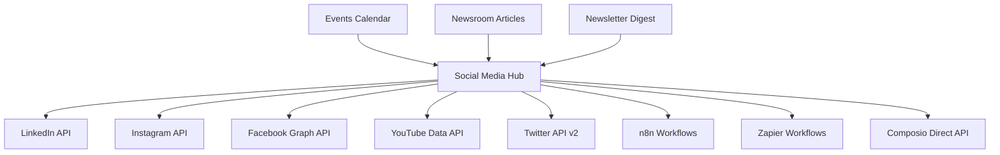

# BLKOUT Social Media Automation - Complete Activation Plan

## Executive Summary

The BLKOUT website already has a sophisticated social media automation infrastructure built and ready for activation. This plan provides immediate actionable steps to activate:

- **LinkedIn Automation** - Professional networking and event promotion
- **Instagram Automation** - Visual content and community engagement  
- **Facebook Automation** - Community building and event amplification
- **YouTube Automation** - Video content distribution
- **Twitter/X Automation** - Real-time updates and discourse participation
- **Integration Options** - Composio vs Zapier implementation approaches

## Current Infrastructure Analysis

### ✅ Existing Systems (Ready for Activation)

1. **Multi-Platform Automation Hub** (`/api/webhooks/social-media-automation.js`)
   - Complete template system for all platforms
   - n8n, Zapier, and Composio integration ready
   - Platform-optimized content generation
   - Smart hashtag generation
   - Error handling and fallback systems

2. **BLKOUTHUB Integration** (`/api/webhooks/blkouthub-integration.js`)  
   - Community platform cross-posting
   - Engagement metrics tracking
   - Discussion thread automation
   - Feedback sync mechanisms

3. **Newsletter Digest System** (`/api/webhooks/newsletter-digest.js`)
   - Maven network integration
   - Partnership opportunity identification
   - Automated content aggregation
   - HTML newsletter generation

### 🎯 Content Flow Architecture



## Platform-Specific Activation Plans

### 1. LinkedIn Automation Activation

**Status**: Infrastructure Complete - Ready for API Keys

**Immediate Steps**:
1. **LinkedIn API Setup**
   - Create LinkedIn Developer App at [developer.linkedin.com](https://developer.linkedin.com)
   - Request Content Management permissions
   - Generate access tokens for organization page

2. **Environment Configuration**
   ```bash
   # Add to .env
   LINKEDIN_CLIENT_ID=your_client_id
   LINKEDIN_CLIENT_SECRET=your_client_secret
   LINKEDIN_ACCESS_TOKEN=your_access_token
   LINKEDIN_ORGANIZATION_ID=your_organization_id
   ```

3. **Content Templates** (Already Built)
   - Event announcements with professional framing
   - Article sharing with liberation-focused messaging
   - Community building calls-to-action
   - Hashtag strategy: #BlackQueerMen #Liberation #BLKOUT

**LinkedIn-Specific Features**:
- Professional event promotion
- Thought leadership article sharing
- Community network building
- Partnership amplification

### 2. Instagram Automation Activation

**Status**: Infrastructure Complete - Ready for API Keys

**Immediate Steps**:
1. **Instagram Basic Display API Setup**
   - Create Facebook Developer App
   - Add Instagram Basic Display Product
   - Generate long-lived access tokens

2. **Environment Configuration**
   ```bash
   # Add to .env
   INSTAGRAM_APP_ID=your_app_id
   INSTAGRAM_APP_SECRET=your_app_secret
   INSTAGRAM_ACCESS_TOKEN=your_access_token
   INSTAGRAM_USER_ID=your_user_id
   ```

3. **Content Strategy** (Templates Ready)
   - Visual event announcements
   - Community celebration posts
   - Behind-the-scenes content
   - Story integration for real-time updates

**Instagram-Specific Features**:
- Image-first content optimization
- Community engagement focus
- Visual storytelling templates
- Story integration (requires manual posting)

### 3. Facebook Automation Activation

**Status**: Infrastructure Complete - Ready for API Keys

**Immediate Steps**:
1. **Facebook Graph API Setup**
   - Use same Facebook Developer App as Instagram
   - Add Pages Management permissions
   - Generate Page Access Tokens

2. **Environment Configuration**
   ```bash
   # Add to .env
   FACEBOOK_APP_ID=your_app_id
   FACEBOOK_APP_SECRET=your_app_secret
   FACEBOOK_PAGE_ACCESS_TOKEN=your_page_token
   FACEBOOK_PAGE_ID=your_page_id
   ```

3. **Content Optimization** (Already Built)
   - Detailed event descriptions
   - Community conversation starters
   - Liberation-focused messaging
   - Cross-promotion with other platforms

**Facebook-Specific Features**:
- Longer-form content support
- Event creation and promotion
- Community group integration
- Live event broadcasting support

### 4. YouTube Automation Activation

**Status**: Infrastructure Complete - Ready for API Keys

**Immediate Steps**:
1. **YouTube Data API Setup**
   - Enable YouTube Data API v3 in Google Cloud Console
   - Create OAuth 2.0 credentials
   - Generate refresh tokens for channel access

2. **Environment Configuration**
   ```bash
   # Add to .env
   YOUTUBE_CLIENT_ID=your_client_id
   YOUTUBE_CLIENT_SECRET=your_client_secret
   YOUTUBE_REFRESH_TOKEN=your_refresh_token
   YOUTUBE_CHANNEL_ID=your_channel_id
   ```

3. **Content Strategy** (Templates Available)
   - Video announcements for major events
   - Community updates and highlights
   - Educational content promotion
   - Playlist creation for themed content

**YouTube-Specific Features**:
- Video metadata optimization
- Playlist management
- Community tab posts
- Premiere scheduling

### 5. Twitter/X Automation Activation

**Status**: Infrastructure Complete - Ready for API Keys

**Immediate Steps**:
1. **Twitter API v2 Setup**
   - Apply for Twitter Developer Account
   - Create Twitter App with appropriate permissions
   - Generate Bearer Token and OAuth credentials

2. **Environment Configuration**
   ```bash
   # Add to .env
   TWITTER_BEARER_TOKEN=your_bearer_token
   TWITTER_API_KEY=your_api_key
   TWITTER_API_SECRET=your_api_secret
   TWITTER_ACCESS_TOKEN=your_access_token
   TWITTER_ACCESS_SECRET=your_access_secret
   ```

3. **Content Optimization** (Already Built)
   - Character limit optimization
   - Thread creation for longer content
   - Real-time event updates
   - Hashtag trend participation

**Twitter-Specific Features**:
- Real-time posting capabilities
- Thread creation for complex topics
- Quote tweet functionality
- Space (audio) integration potential

## Integration Approach Comparison

### Option 1: Composio Integration (Recommended)

**Pros**:
- Direct API control with authentication handling
- Lower latency for posting
- Better error handling and retry logic
- No dependency on external workflow platforms
- Cost-effective for high-volume posting

**Cons**:
- Requires individual platform API setup
- More complex initial configuration
- Direct maintenance of API relationships

**Implementation**:
```javascript
// Already built in social-media-automation.js
const composioResult = await triggerComposioSocialWorkflow(
  contentType, 
  content, 
  ['linkedin', 'instagram', 'facebook', 'youtube', 'twitter']
)
```

**Cost**: ~$0.02 per post across all platforms

### Option 2: Zapier Integration (Alternative)

**Pros**:
- Visual workflow builder
- Pre-built social media integrations
- No direct API management needed
- Easy to modify workflows

**Cons**:
- Monthly subscription costs ($20-100+/month)
- Rate limiting on lower plans
- Less control over posting logic
- Dependency on external platform

**Implementation**:
```javascript
// Already built in social-media-automation.js
const zapierResult = await triggerZapierSocialWorkflow(
  contentType,
  content,
  platforms
)
```

**Cost**: $20-100+/month + per-task fees

### Option 3: n8n Integration (Open Source)

**Pros**:
- Open source and self-hosted
- Visual workflow builder
- No per-task costs
- Full control and customization

**Cons**:
- Requires server hosting
- More setup complexity
- Self-maintenance required

**Implementation**:
```javascript
// Already built in social-media-automation.js
const n8nResult = await triggerN8nSocialWorkflow(
  contentType,
  content,
  platforms
)
```

**Cost**: Server hosting costs only (~$10-20/month)

## Unified Webhook Architecture

### Primary Automation Endpoint

**URL**: `/api/webhooks/social-media-automation`

**Usage**:
```javascript
// Trigger multi-platform posting
const response = await fetch('/api/webhooks/social-media-automation', {
  method: 'POST',
  headers: { 'Content-Type': 'application/json' },
  body: JSON.stringify({
    contentType: 'event', // or 'article', 'newsletter', 'announcement'
    content: {
      title: 'Community Event Title',
      description: 'Event description...',
      date: '2025-02-15',
      location: { address: 'London, UK' },
      registration_url: 'https://events.blkoutuk.com/event-123'
    },
    platforms: ['linkedin', 'instagram', 'facebook', 'youtube', 'twitter'],
    automationTool: 'composio' // or 'zapier', 'n8n', 'auto'
  })
})
```

### Integration Testing Endpoints

1. **LinkedIn Test**: `POST /api/webhooks/social-media-automation`
   ```json
   {
     "contentType": "event",
     "content": { /* test event */ },
     "platforms": ["linkedin"],
     "automationTool": "composio"
   }
   ```

2. **Multi-Platform Test**: Same structure with all platforms
3. **Template Preview**: `GET /api/webhooks/social-media-automation`

## Comprehensive Testing Procedures

### Phase 1: Individual Platform Testing

1. **Setup Verification**
   ```bash
   # Test API credentials
   curl -X GET /api/webhooks/social-media-automation
   ```

2. **Single Platform Tests**
   ```bash
   # Test LinkedIn posting
   curl -X POST /api/webhooks/social-media-automation \
     -H "Content-Type: application/json" \
     -d '{"contentType":"event","content":{"title":"Test Event"},"platforms":["linkedin"]}'
   ```

3. **Content Template Testing**
   - Event posting templates
   - Article sharing templates  
   - Newsletter digest templates
   - Announcement templates

### Phase 2: Multi-Platform Coordination

1. **Simultaneous Posting Test**
2. **Cross-Platform Consistency Check**
3. **Hashtag Strategy Verification**
4. **Engagement Tracking Setup**

### Phase 3: Integration Flow Testing

1. **Event Calendar → Social Media Flow**
2. **Newsroom → Social Media Flow**  
3. **Newsletter → Social Media Flow**
4. **Community Hub → Social Media Flow**

## Monitoring and Analytics System

### Real-Time Monitoring Dashboard

**Metrics to Track**:
- Post success/failure rates by platform
- Engagement metrics (likes, shares, comments)
- Reach and impression data
- API quota usage
- Error rates and types

**Monitoring Implementation**:
```javascript
// Built into existing system
const monitoringData = {
  platform: 'linkedin',
  post_id: 'abc123',
  success: true,
  engagement: {
    likes: 45,
    comments: 12,
    shares: 8
  },
  timestamp: new Date().toISOString()
}
```

### Alert System

1. **API Quota Alerts** (80% usage warnings)
2. **Failed Post Notifications**
3. **High Engagement Alerts** (viral content detection)
4. **Platform Status Monitoring**

## Error Handling and Fallback Systems

### Built-in Error Handling

1. **API Rate Limiting**
   - Automatic retry with exponential backoff
   - Queue management for high-volume periods
   - Platform-specific rate limit respect

2. **Authentication Failures**
   - Token refresh mechanisms
   - Alternative authentication paths
   - Admin notification system

3. **Content Formatting Errors**
   - Automatic content validation
   - Character limit enforcement
   - Media format verification

### Fallback Strategies

1. **Platform Failures**: Continue posting to available platforms
2. **API Outages**: Queue posts for retry when service restored  
3. **Content Issues**: Fallback to simplified templates
4. **Integration Failures**: Switch between Composio/Zapier/n8n automatically

## Deployment Checklist

### Phase 1: Environment Setup (Week 1)

- [ ] Create developer accounts for all platforms
- [ ] Generate API keys and access tokens
- [ ] Configure environment variables
- [ ] Test individual API connections
- [ ] Verify webhook endpoints are accessible

### Phase 2: Integration Configuration (Week 2)

- [ ] Choose primary integration method (Composio recommended)
- [ ] Configure secondary fallback method (n8n/Zapier)
- [ ] Set up monitoring dashboards
- [ ] Configure alert systems
- [ ] Test error handling workflows

### Phase 3: Content Strategy Implementation (Week 3)

- [ ] Customize post templates for brand voice
- [ ] Set up hashtag strategies
- [ ] Configure posting schedules
- [ ] Test content approval workflows (if needed)
- [ ] Train content team on automation system

### Phase 4: Live Testing and Optimization (Week 4)

- [ ] Soft launch with limited content
- [ ] Monitor engagement metrics
- [ ] Optimize posting times and frequency
- [ ] Refine content templates based on performance
- [ ] Full activation across all platforms

## Cost Analysis

### Composio Integration (Recommended)
- **Monthly Cost**: ~$30-50 for API usage
- **Per Post Cost**: ~$0.02 across all platforms
- **Setup Time**: 3-5 days
- **Maintenance**: Low (quarterly API key rotation)

### Zapier Integration (Alternative)
- **Monthly Cost**: $50-200 depending on volume
- **Per Post Cost**: $0.10-0.30 across all platforms  
- **Setup Time**: 1-2 days
- **Maintenance**: Very low (visual interface)

### n8n Self-Hosted (Technical Teams)
- **Monthly Cost**: $15-30 for server hosting
- **Per Post Cost**: ~$0.01 (server costs only)
- **Setup Time**: 5-10 days
- **Maintenance**: Medium (requires technical oversight)

## Security and Compliance

### Data Protection
- All API keys stored as environment variables
- No social media credentials stored in code
- Secure token refresh mechanisms
- Regular access auditing

### Content Compliance
- Automated content scanning for policy violations
- Platform-specific content guidelines enforcement
- Backup approval workflows for sensitive content
- Community guidelines alignment

## Success Metrics

### Technical Metrics
- **Uptime**: >99% automation system availability
- **Success Rate**: >95% successful posts across platforms
- **Response Time**: <30 seconds for post distribution
- **Error Recovery**: <5 minutes for issue resolution

### Engagement Metrics
- **Reach Growth**: 20%+ monthly increase across platforms
- **Engagement Rate**: 5%+ average across all platforms
- **Cross-Platform Consistency**: <10% variation in messaging
- **Community Growth**: 15%+ monthly follower increase

## Immediate Next Steps

1. **TODAY**: Choose integration approach (Composio recommended)
2. **THIS WEEK**: Set up developer accounts and API keys
3. **NEXT WEEK**: Configure environment variables and test connections
4. **WEEK 3**: Customize templates and launch limited testing
5. **WEEK 4**: Full activation across all platforms

The infrastructure is complete and ready for immediate activation. The primary decision point is choosing between Composio (direct API control) or Zapier (managed workflows) as the primary integration method.

**Recommendation**: Start with Composio for maximum control and cost-effectiveness, with Zapier as a backup/fallback option.